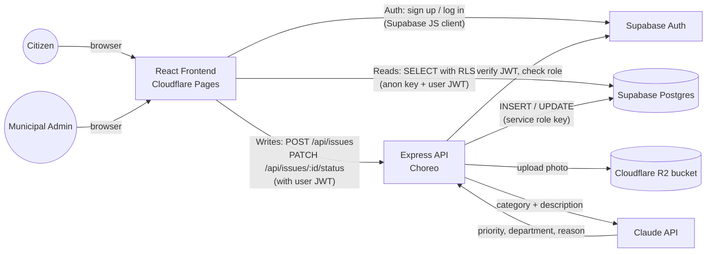
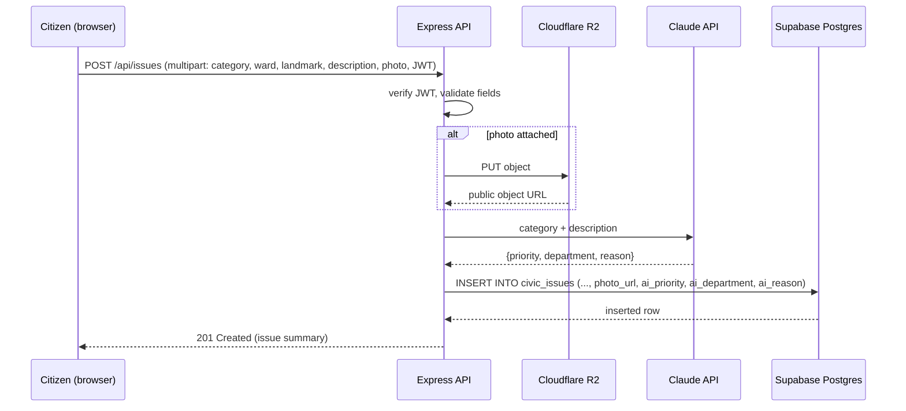
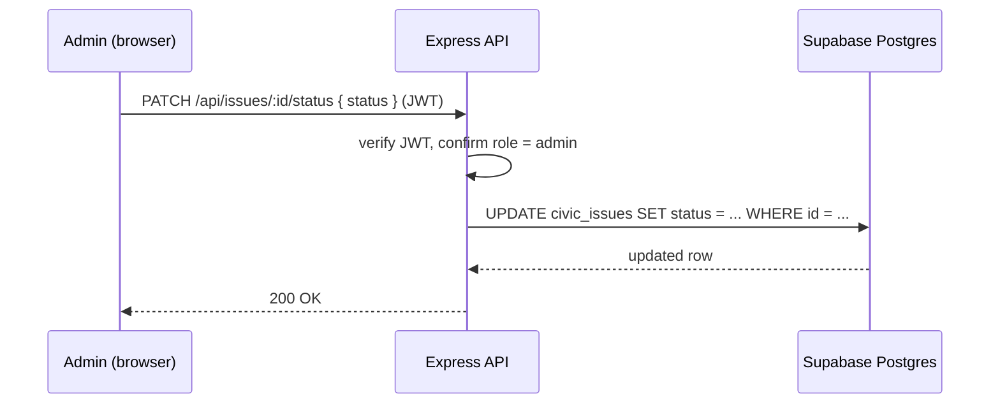
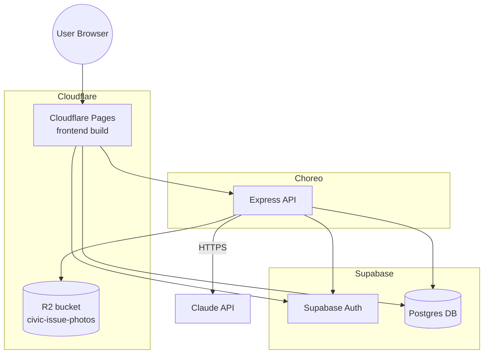

# 04 — System Architecture

## Stack summary

| Layer | Technology | Deployment |
|---|---|---|
| Frontend | React + Vite + Tailwind CSS | Cloudflare Pages |
| Backend API | Node.js + Express | WSO2 Choreo (fallback: Render) |
| Database + Auth | Supabase (PostgreSQL + Supabase Auth) | Supabase-hosted |
| File storage | Cloudflare R2 (S3-compatible) | Cloudflare-hosted, public bucket |
| AI | Anthropic Claude API | Called server-side from Express |

## System context

## Why this shape

- **The frontend never writes to Supabase directly.** All inserts/updates go through Express, which uses the Supabase **service role key** — a secret that must never reach the browser. This is also where the R2 upload and the Claude triage call happen, so a single `POST /api/issues` produces a fully-formed, AI-triaged row.
- **The frontend can read directly from Supabase** using the anon key and the logged-in user's JWT, relying on Row Level Security to scope what each role can see (citizens see their own issues; admins see all). This is optional — the admin dashboard may instead call `GET /api/issues` on the backend for a single consistent data path. Pick one per feature and stay consistent; don't mix both for the same screen.
- **Role checking happens server-side**, in Express, by verifying the caller's Supabase JWT (`supabase.auth.getUser(token)`) and looking up their role in the `profiles` table — never trust a role claim sent from the client.

## Request flow: citizen submits an issue

## Request flow: admin updates status

## Deployment topology

## Key decisions & rationale

| Decision | Rationale |
|---|---|
| Photo upload proxied through Express, not a presigned URL from the browser | Avoids configuring CORS on the R2 bucket and a two-step upload flow — not worth the setup time in a 4-hour build |
| R2 bucket set to public read access | Photos are non-sensitive (public civic issues); a public URL avoids building signed-URL generation for viewing |
| All Supabase writes via service role key in the backend | Centralizes business logic (validation, AI triage) in one place, and keeps the write path secure regardless of frontend bugs |
| Role stored in a `profiles` table, not just Supabase Auth metadata | Supabase Auth doesn't natively separate "citizen" vs "admin" — RLS policies need a queryable role column |
| Admin accounts seeded manually, not self-registered | Removes an entire signup/approval flow that isn't needed for a hackathon demo, and avoids an obvious security hole |
