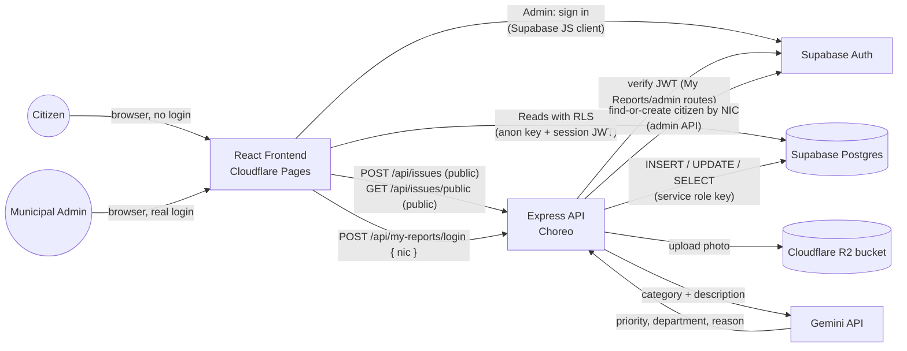
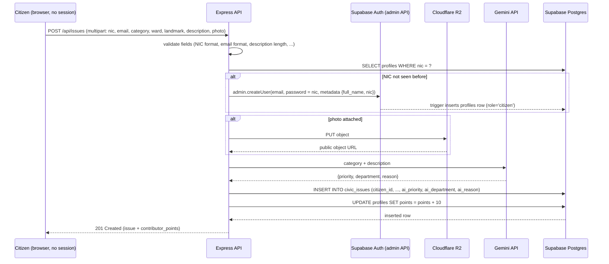
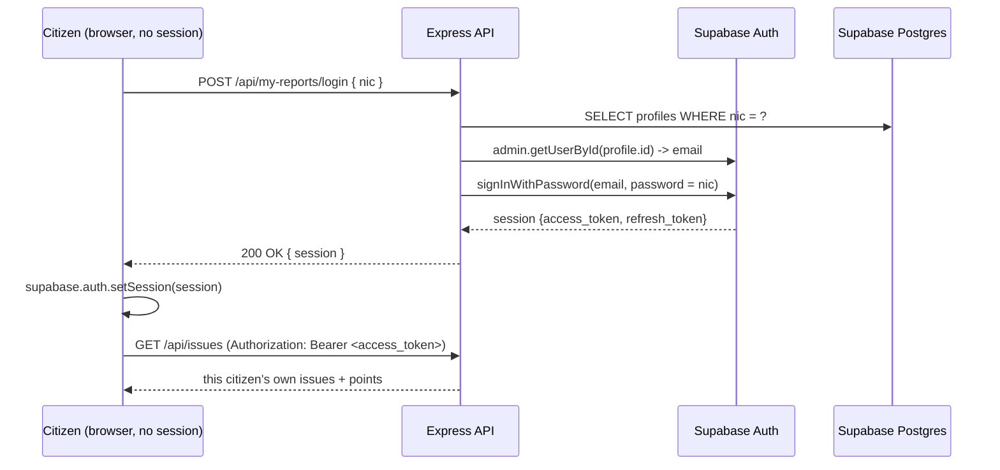
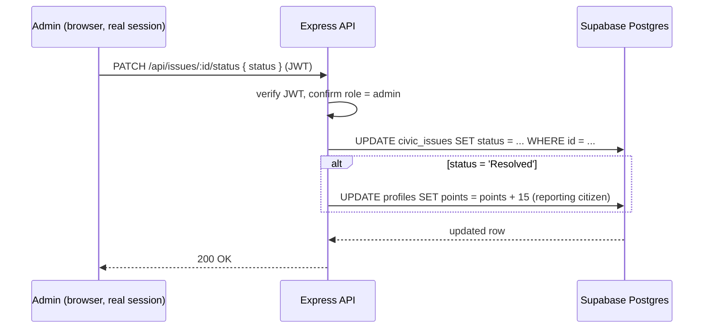

# 04 — System Architecture

## Stack summary

| Layer | Technology | Deployment |
|---|---|---|
| Frontend | React + Vite + Tailwind CSS | Cloudflare Pages |
| Backend API | Node.js + Express | WSO2 Choreo (fallback: Render) |
| Database + Auth | Supabase (PostgreSQL + Supabase Auth) | Supabase-hosted |
| File storage | Cloudflare R2 (S3-compatible) | Cloudflare-hosted, public bucket |
| AI | Google Gemini API | Called server-side from Express |

## System context

Citizens never authenticate directly — reporting and browsing are public. Only "My Reports" (a citizen viewing their own history) and the admin dashboard involve a session.

## Why this shape

- **The frontend never writes to Supabase directly.** All inserts/updates go through Express, which uses the Supabase **service role key** — a secret that must never reach the browser. This is also where the R2 upload, the Gemini triage call, and citizen account provisioning happen, so a single `POST /api/issues` produces a fully-formed, AI-triaged row with no separate signup step.
- **Reporting and browsing require no session at all.** `POST /api/issues` and `GET /api/issues/public` are public routes — see [`06-api-specification.md`](06-api-specification.md). This is deliberate: nobody should have to log in to report a pothole or see what's already been reported.
- **A session only exists for "My Reports" and the admin dashboard.** A citizen gets one implicitly, by typing their NIC into `POST /api/my-reports/login`, which signs them in server-side (email + NIC-as-password) and hands back a real Supabase session for the frontend to adopt with `supabase.auth.setSession()`. An admin gets one the normal way, straight from Supabase Auth in the browser.
- **Role checking happens server-side**, in Express, by verifying the caller's Supabase JWT (`supabase.auth.getUser(token)`) and looking up their role in the `profiles` table — never trust a role claim sent from the client.

## Request flow: citizen submits an issue (also functions as signup)

## Request flow: citizen views "My Reports"

## Request flow: admin updates status

## Deployment topology

## Key decisions & rationale

| Decision | Rationale |
|---|---|
| Reporting (`POST /api/issues`) and browsing (`GET /api/issues/public`) are public routes | Matches how residents actually behave — nobody creates an account before checking if a pothole is already reported |
| The report form doubles as signup (NIC + email, no separate registration screen) | Removes friction; the backend auto-provisions an account on first NIC, reuses it after |
| Password for auto-provisioned accounts = the citizen's own NIC | Lets "My Reports" work with just a NIC typed in, no password ever shown — a deliberate, documented trade-off (see [`05-data-model.md`](05-data-model.md)) |
| Email is still collected (not synthesized) | Supabase Auth requires a real email as the account's login identity; NIC remains the durable identity key regardless |
| Photo upload proxied through Express, not a presigned URL from the browser | Avoids configuring CORS on the R2 bucket and a two-step upload flow — not worth the setup time in a 4-hour build |
| R2 bucket set to public read access | Photos are non-sensitive (public civic issues); a public URL avoids building signed-URL generation for viewing |
| All Supabase writes via service role key in the backend | Centralizes business logic (validation, AI triage, points) in one place, and keeps the write path secure regardless of frontend bugs |
| Role stored in a `profiles` table, not just Supabase Auth metadata | Supabase Auth doesn't natively separate "citizen" vs "admin" — RLS policies need a queryable role column |
| Admin accounts seeded manually, not self-registered | Removes an entire signup/approval flow that isn't needed for a hackathon demo, and avoids an obvious security hole |
| Contribution points tracked as a simple counter, updated in application code | A DB trigger/ledger table would be more "correct" but harder to explain live in the demo Q&A; a counter is enough to prove the concept |
